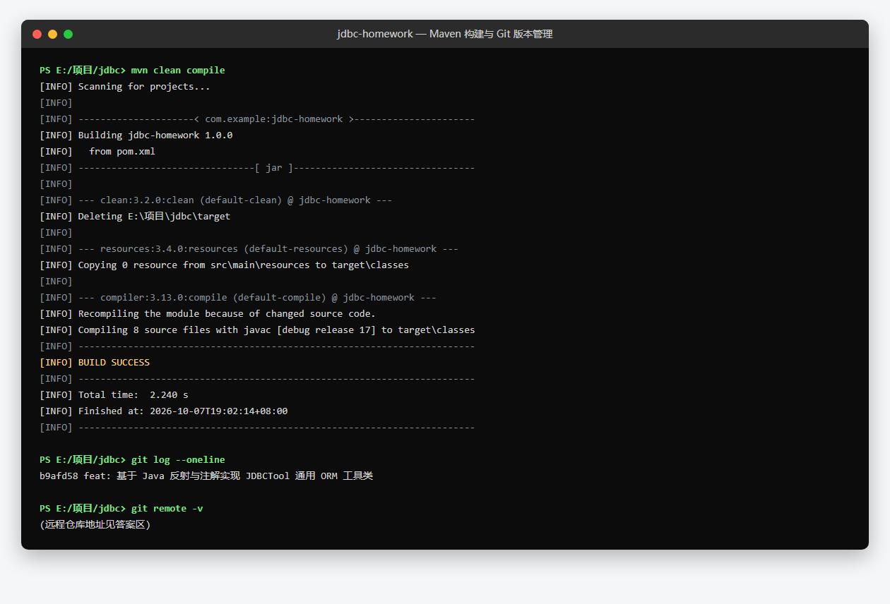
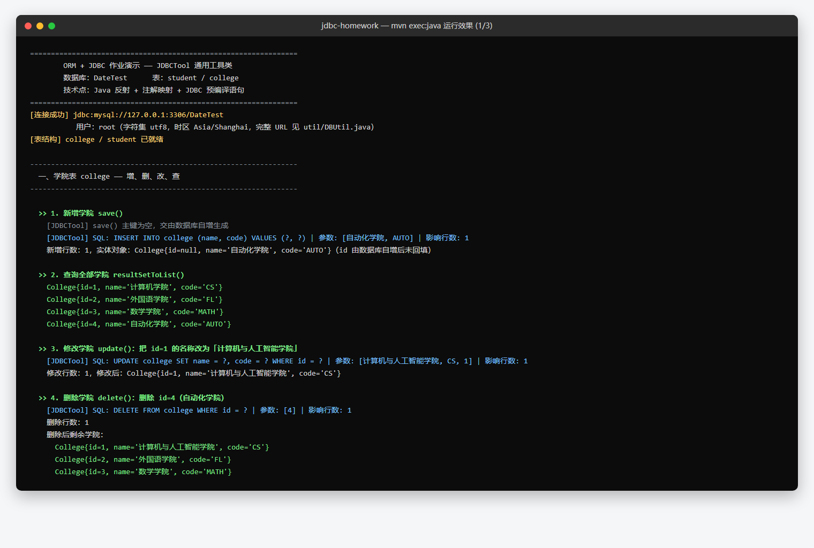
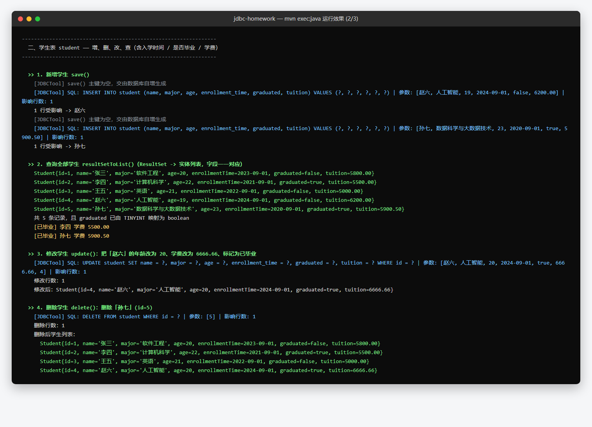
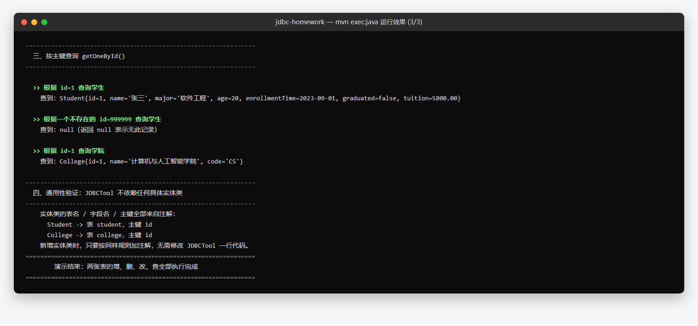

# JDBC 作业答案

> 作业内容：实现 JDBCTool 通用工具类（反射 + 注解实现 ORM），完成 DateTest 库
> student（学生表）与 college（学院表）的增删改查，Maven 构建，Git 版本管理。

---

## 一、运行效果抓图

### 1. Maven 构建成功 & Git 版本管理



### 2. 学院表 college —— 增、删、改、查



### 3. 学生表 student —— 增、删、改、查（含入学时间 / 是否毕业 / 学费）



### 4. 按主键查询 getOneById & ORM 通用性验证



---

## 二、仓库 URL

**远程仓库（GitHub）：<https://github.com/labixiaoxin648/jdbc-homework>**

```text
https://github.com/labixiaoxin648/jdbc-homework.git
```

本地仓库路径：`file:///E:/项目/jdbc`

远程仓库包含 3 次提交，提交历史与本地完全一致：

```text
be9906a  docs: 添加作业答案文档（运行抓图与仓库地址）
7e88555  docs: 补充 Maven 构建与 Git 版本管理运行截图
9fbc545  feat: 基于 Java 反射与注解实现 JDBCTool 通用 ORM 工具类
```

> 仓库为公开仓库，老师可直接访问；克隆命令：`git clone https://github.com/labixiaoxin648/jdbc-homework.git`

---

## 三、环境说明

| 项 | 内容 |
| --- | --- |
| JDK | Oracle JDK 17.0.9（`D:\Java`） |
| 构建工具 | Apache Maven 3.9.16 |
| 数据库 | MySQL 8.0.44（本机 3306，账号 root / 123456） |
| 数据库 | 库 `DateTest`，表 `student`（7 字段）、`college`（3 字段） |
| 驱动 | mysql-connector-java 8.0.30 |

运行方式：

```bash
cd /d E:\项目\jdbc
mvn clean compile exec:java
```

数据库脚本：`sql/date_test.sql`（建库、建表、初始数据）；
程序启动时也会自动 `CREATE TABLE IF NOT EXISTS`，保证演示可直接运行。

---

## 四、核心实现说明

**1. 反射 + 注解建立 ORM 映射**

- `@Table("student")` → 表名；`@Column("enrollment_time")` → 字段名（未标注时驼峰自动转下划线）；
- `@Id` → 主键，`update` / `delete` / `getOneById` 以它构造 WHERE 条件；
- `JDBCTool.newInstance()` 反射调用无参构造创建对象；
- `JDBCTool.setFieldValue()` 反射为属性赋值，`convertValue()` 完成
  `TINYINT → Boolean`、`DATE → LocalDate`、`DECIMAL → BigDecimal` 等类型转换。

**2. 五个方法**

| 方法 | 说明 |
| --- | --- |
| `resultSetToList(ResultSet, Class<T>)` | 遍历结果集，逐行反射建对象并按列名回填属性 |
| `save(T, Connection)` | 由非空属性动态拼装 `INSERT INTO ... VALUES (?, ...)` |
| `update(T, Connection)` | 动态拼装 `UPDATE ... SET ... WHERE 主键 = ?` |
| `delete(T, Connection)` | `DELETE FROM ... WHERE 主键 = ?` |
| `getOneById(String, Class<T>, Connection)` | `SELECT * ... WHERE 主键 = ?` → 单个对象 |

**3. 辅助方法（统一访问支撑）**

`resolveTableName` / `resolveColumnName` / `resolveIdField` / `resolveFieldColumnMap` /
`convertValue` / `toNumber` / `toBoolean` / `camelToUnderscore` / `bindParameters` /
`executeUpdate` / `resultSetLabels` / `getFieldValue` / `setFieldValue` / `newInstance`。

**4. 安全性**

所有 SQL 均使用 `PreparedStatement` 占位符传参，杜绝 SQL 注入。
